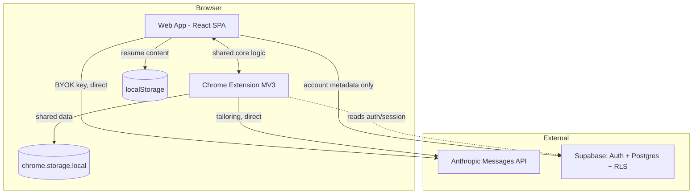
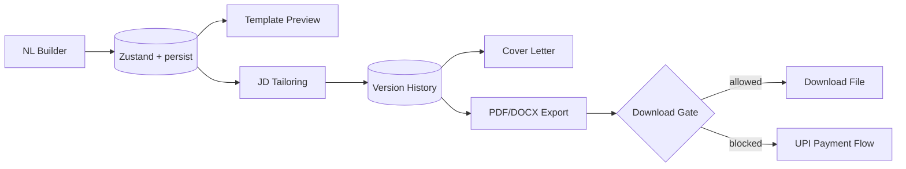

# Design Document

## Overview

ResumeForge is a client-heavy application consisting of two deliverables that share a common data model and AI logic:

1. **Web app** — React 18 + TypeScript + Vite SPA. Handles resume building, templating, tailoring, cover letters, export, accounts, download gating, payment flow, and the admin panel.
2. **Chrome extension** — Manifest V3 (content script + popup) that detects job postings, reuses tailoring logic, and autofills application forms (never auto-submits).

The architecture is deliberately backend-light. There is no custom server. The only backend is **Supabase** (Auth + Postgres + RLS), used exclusively for tamper-proof account metadata: profiles, download counts, credits, payment requests, products, payment settings, and the admin allow-list. Resume content stays in the browser (`localStorage`, optionally synced later). All AI calls go **directly from the browser to `api.anthropic.com`** using the user's own key.

### Design Goals
- **Trustworthy limits:** trial counts and credits live in Postgres behind RLS, so clearing browser storage cannot reset them.
- **Privacy by default:** resume content and the API key never touch the backend.
- **Delightful UX:** real-time preview, smooth drag-and-drop, clear loading/empty/error states.
- **Configurable deployment:** Supabase URL/anon key come from environment variables.
- **Shared core:** a `core` package holds the data model, AI prompt builders, and gating logic reused by both web app and extension.

### Key Design Decisions

| Decision | Choice | Rationale |
|---|---|---|
| Backend | Supabase only | No server to maintain; RLS makes limits tamper-proof |
| AI transport | Browser → Anthropic direct, BYOK | No key custody, no proxy cost |
| Resume storage | `localStorage` (Zustand persist) | Privacy; sync is a v1 nice-to-have |
| PDF export | `react-pdf` (@react-pdf/renderer) | True selectable text, not rasterized |
| DOCX export | `docx` (dolanmiu) | Real Word structure, ATS-parseable |
| Payment | UPI deep link + `qrcode` + manual verify | No gateway fees or integration |
| State | Zustand (+persist) | Lightweight, ergonomic for local-first |
| Code sharing | `packages/core` shared module | One source of truth for model + AI logic |

## Architecture

### System Context



### Monorepo Structure

```
resume-forge/
├── packages/
│   └── core/                 # Shared: types, AI prompt builders, gating logic, validators
│       ├── model/            # ResumeData schema + zod validators
│       ├── ai/               # prompt builders + Anthropic client wrapper
│       ├── gating/           # download-gating decision function (pure)
│       └── index.ts
├── apps/
│   ├── web/                  # React + Vite web app
│   │   ├── src/
│   │   │   ├── features/     # builder, templates, tailoring, cover-letter, export, account, payment, admin
│   │   │   ├── store/        # Zustand stores
│   │   │   ├── lib/          # supabase client, anthropic client, pdf/docx exporters
│   │   │   └── components/   # shared UI (loading, empty, error states)
│   │   └── .env              # VITE_SUPABASE_URL, VITE_SUPABASE_ANON_KEY
│   └── extension/            # Manifest V3 extension
│       ├── src/
│       │   ├── content/      # site adapters (linkedin, indeed, naukri), JD extraction, autofill
│       │   ├── popup/        # tailor + autofill UI
│       │   └── background/   # service worker
│       └── manifest.json
└── supabase/
    ├── migrations/           # SQL schema + RLS policies
    └── seed.sql
```

### Data Boundaries

| Data | Location | Never goes to |
|---|---|---|
| Resume content | `localStorage` (+ optional `resumes` table with RLS) | Anthropic (except when user triggers extraction/tailoring), no other server |
| Anthropic API key | `localStorage` only | Supabase, any server other than Anthropic |
| Account metadata (profile, counts, credits) | Supabase Postgres | Anthropic |
| Payment requests / products / settings | Supabase Postgres | Anthropic |

## Components and Interfaces

### Core Data Model (`packages/core/model`)

```typescript
interface ResumeData {
  personalInfo: {
    name: string; email: string; phone: string;
    location: string; linkedin?: string; portfolio?: string;
  };
  summary: string;
  experience: ExperienceItem[];
  education: EducationItem[];
  skills: SkillCategory[];      // categorized: Technical, Tools, Soft Skills
  projects: ProjectItem[];
  certifications: Certification[];
}

interface ExperienceItem {
  id: string; company: string; title: string; location: string;
  startDate: string; endDate: string; bullets: Bullet[];
}
interface Bullet { id: string; text: string; }          // id enables drag-and-drop + diffing
interface SkillCategory { id: string; name: string; skills: string[]; }
interface ProjectItem { id: string; name: string; description: string; bullets: Bullet[]; techStack: string[]; }
interface EducationItem { id: string; institution: string; degree: string; field: string; startDate: string; endDate: string; gpa?: string; }
interface Certification { id: string; name: string; issuer?: string; date?: string; }

// Versioning
interface ResumeVersion {
  id: string;
  label: string;                // "Base Resume" | "Tailored — Acme 2026-07-11"
  kind: 'base' | 'tailored';
  data: ResumeData;
  createdAt: string;
  tailoring?: TailoringMeta;     // present when kind==='tailored'
}
interface TailoringMeta {
  jobDescription: string; company?: string;
  matchScore: number;            // 0-100
  gaps: string[];
  changes: BulletChange[];       // for diff view
}
interface BulletChange { path: string; original: string; tailored: string; accepted: boolean; }
```

All shapes validated with `zod` so malformed AI responses are caught (Req 2.7).

### AI Layer (`packages/core/ai`)

A thin wrapper over the Anthropic Messages API called directly with `fetch` and the user's key. Three prompt builders:

- **`buildExtractionPrompt(freeformText)`** → system prompt instructs strict JSON extraction to the `ResumeData` schema. Response parsed + zod-validated. (Req 2.2, 2.7)
- **`buildTailoringPrompt(resume, jd)`** → system prompt enforces the no-fabrication rule, asks for reordered/re-weighted/rephrased content plus `matchScore` and `gaps`. Returns tailored `ResumeData` + `TailoringMeta`. (Req 4.2-4.4)
- **`buildCoverLetterPrompt(resume, jd, tone)`** → 3-4 paragraph letter with tone applied. (Req 5.1-5.2)

```typescript
interface AnthropicClient {
  send(messages: Message[], system: string, opts?: { maxTokens?: number }): Promise<string>;
}
// Errors mapped to typed results so UI can show actionable messages (Req 1.6)
type AiResult<T> = { ok: true; value: T } | { ok: false; error: 'no_key' | 'auth' | 'rate_limit' | 'parse' | 'network'; message: string };
```

**No-fabrication enforcement (Req 4.3):** Beyond the prompt instruction, after tailoring the client validates that no new employers/dates/degrees/skill names appear that weren't in the source `ResumeData` (set comparison on structured fields). Any fabricated entity is stripped and flagged, so the guarantee is not solely prompt-dependent.

### Web App Features



- **Builder** (Req 2): chat-like intake → extraction → editable form. Drag-and-drop via `@dnd-kit`. PDF text import via `pdfjs-dist` (client-side). Debounced autosave (Req 2.6).
- **Templates** (Req 3): 5 template renderers consuming the same `ResumeData`. A `TemplateRenderer` interface renders both to screen (HTML/Tailwind) and to `react-pdf` primitives. Font + accent color from a safe palette. Two-column shows an ATS warning badge.
- **Tailoring** (Req 4): produces a new `ResumeVersion` (never overwrites base). Diff view shows `BulletChange` pairs with accept/tweak/revert per change.
- **Cover Letter** (Req 5): tone selector; editable; exported in the same template family.
- **Export** (Req 6): `react-pdf` for PDF (selectable text), `docx` for Word; runs through the gate first.
- **Account** (Req 7): Supabase Auth (email/password + Google). Build/edit allowed pre-login; download prompts login.
- **Payment** (Req 9): `qrcode` renders the UPI deep link; "I've paid" inserts a `payment_requests` row.
- **Admin** (Req 10): separate `/admin` route, gated by `admins` table via RLS.

### Download Gating (`packages/core/gating`)

Pure decision function; the mutation happens against Supabase (RLS-protected) so it can't be bypassed by clearing storage (Req 8.10).

```typescript
type GateDecision =
  | { action: 'allow'; reason: 'free_forever' }
  | { action: 'allow_and_increment_free' }
  | { action: 'allow_and_decrement_credit' }
  | { action: 'require_payment'; productId: string };

function decideDownload(profile: Profile, credits: UserCredit[], productId: string): GateDecision;
```

Order (Req 8.2-8.6): `is_free_forever` → `free_downloads_used < 2` (shared across products) → `credits_remaining > 0` for product → require payment. The actual increment/decrement is performed via a Supabase RPC (Postgres function) that runs atomically under the caller's RLS context, preventing race conditions and client tampering.

### Chrome Extension

- **Content scripts** with per-site adapters (`linkedin.ts`, `indeed.ts`, `naukri.ts`) implementing a common `SiteAdapter` interface: `detectPosting()`, `extractJD()`, `findFormFields()`, `fillFields(map)`. Selectors isolated per adapter since portal DOMs change often.
- **Popup** offers "Tailor resume for this job?" (reuses `packages/core/ai`) and "Autofill this application".
- **Autofill** maps `ResumeData` fields to detected inputs via label-matching heuristics; **never** clicks Submit (Req 11.6). Displays best-effort disclaimer (Req 11.7).
- Shares resume/auth data via `chrome.storage.local` (Req 11.2).

```typescript
interface SiteAdapter {
  matches(url: string): boolean;
  extractJD(): string | null;
  findFormFields(): DetectedField[];
  fillFields(values: Record<string, string>): FillReport;   // reports unmatched fields
}
```

## Data Models

### Supabase Schema

```sql
-- profiles: 1:1 with auth.users
create table profiles (
  id uuid primary key references auth.users(id) on delete cascade,
  email text not null,
  display_name text,
  created_at timestamptz default now(),
  last_login_at timestamptz,
  free_downloads_used int not null default 0,
  is_free_forever boolean not null default false
);

create table products (
  id uuid primary key default gen_random_uuid(),
  name text not null,              -- 'resume_only', 'resume_plus_cover_letter'
  price numeric not null,
  unlocks_count int not null default 1,
  active boolean not null default true
);

create table user_credits (
  user_id uuid references profiles(id) on delete cascade,
  product_id uuid references products(id) on delete cascade,
  credits_remaining int not null default 0,
  primary key (user_id, product_id)
);

create table payment_requests (
  id uuid primary key default gen_random_uuid(),
  user_id uuid references profiles(id) on delete cascade,
  product_id uuid references products(id),
  amount_claimed numeric not null,
  status text not null default 'pending',  -- pending | approved | rejected
  requested_at timestamptz default now(),
  approved_at timestamptz
);

create table payment_settings (
  id int primary key default 1,
  upi_id text not null,
  note text
);

create table admins ( user_id uuid primary key references auth.users(id) on delete cascade );

-- optional v1 nice-to-have
create table resumes (
  id uuid primary key default gen_random_uuid(),
  user_id uuid references profiles(id) on delete cascade,
  data jsonb not null,
  updated_at timestamptz default now()
);
```

### RLS Policy Summary (Req 7.6, 8.10, 9.6, 10.2, 10.10, 12.2)

| Table | Read | Write |
|---|---|---|
| `profiles` | own row (admin: all) | own row except `is_free_forever` & `free_downloads_used` (mutated via RPC); admin can write all |
| `products` | public | admin only |
| `payment_settings` | public | admin only |
| `user_credits` | own rows (admin: all) | admin only (via approve RPC) |
| `payment_requests` | own rows (admin: all) | user may INSERT own; only admin may UPDATE `status` |
| `admins` | admin only | admin only (seeded manually) |
| `resumes` | own rows | own rows |

Sensitive mutations use `security definer` Postgres RPCs so clients cannot set forbidden columns directly:
- `consume_download(product_id)` — applies gating and atomically increments/decrements.
- `approve_payment(request_id)` (admin) — sets status, credits `unlocks_count`, timestamps.
- `reject_payment(request_id)` (admin).
- `set_free_forever(user_id, value)` (admin).

## Error Handling

| Scenario | Handling | Req |
|---|---|---|
| No API key on AI action | Block, open key prompt | 1.5 |
| Anthropic auth/rate-limit | Typed error → actionable message | 1.6 |
| Malformed AI JSON | zod validation fails → recoverable error, preserve existing data | 2.7 |
| Fabricated facts in tailoring | Post-validation strips/flags unknown entities | 4.3 |
| PDF text-extract failure | Fall back to manual paste | 2.5 |
| Supabase network error | Retry/queue message; never lose local resume | 13.3 |
| Download during offline/session-expired | Prompt re-auth, do not consume count | 7.2, 8 |
| Extension field mismatch | Report unmatched fields, require manual review | 11.5, 11.7 |

All errors surface through a shared toast/error-boundary component with non-technical copy (Req 13.3).

## Testing Strategy

- **Unit (pure logic):** `decideDownload` gating matrix; zod validators; no-fabrication set-comparison; UPI deep-link builder; label-matching heuristics.
- **Property-based tests (PBT):** the gating decision function is the highest-value target — see Correctness Properties below.
- **Component tests:** builder form editing, drag-and-drop reorder, diff view accept/revert, template switching preserves data.
- **Integration:** Supabase RPCs with RLS (using a local Supabase instance) for `consume_download`, `approve_payment`, and status-update prevention.
- **Extension:** adapter `extractJD`/`findFormFields` against saved DOM fixtures for each supported site; assert Submit is never triggered.
- **Export:** snapshot/structural checks that PDF text layer is selectable and DOCX contains heading styles.

## Correctness Properties

The following properties are the highest-value targets for Property-Based Testing (PBT):

### Property 1: Free trial cap
Across any sequence of download attempts by a non-free-forever user with no credits, the number of allowed downloads via the free path never exceeds 2, regardless of product-type ordering.
**Validates: Requirements 8.3, 8.4**

### Property 2: Free-forever supremacy
If `is_free_forever` is true, every download attempt returns `allow` and neither `free_downloads_used` nor any `credits_remaining` changes.
**Validates: Requirements 8.2**

### Property 3: Credit conservation
A credit decrement only ever follows exhausted free downloads and a positive balance; total downloads for a product never exceed (free-share used for it) + (credits ever granted for it).
**Validates: Requirements 8.5, 8.8**

### Property 4: No fabrication invariant
For any resume and JD, the set of employers, dates, degrees, and skill names in the tailored output is a subset of those in the source resume.
**Validates: Requirements 4.3**

### Property 5: Base immutability
Any tailoring operation leaves the base `ResumeData` byte-identical; tailored results are always new versions.
**Validates: Requirements 4.5**

### Property 6: Status monotonicity
A `payment_request` only transitions pending → approved or pending → rejected, and credits are granted exactly once per approved request.
**Validates: Requirements 10.6, 10.7**

### Property 7: No auto-submit
For any autofill invocation, the number of Submit/Apply clicks issued by the extension is always zero.
**Validates: Requirements 11.6**

## Deployment & Configuration

- Web app deployed as static assets (Vite build) to any static host.
- `VITE_SUPABASE_URL` and `VITE_SUPABASE_ANON_KEY` provided via environment (operator supplies their own Supabase account — Req 7.7). No secrets baked into source.
- Supabase schema + RLS applied via `supabase/migrations`. `admins` and `payment_settings` seeded manually by the operator.
- Extension packaged separately; points at the same Supabase project and shares the `core` package.
