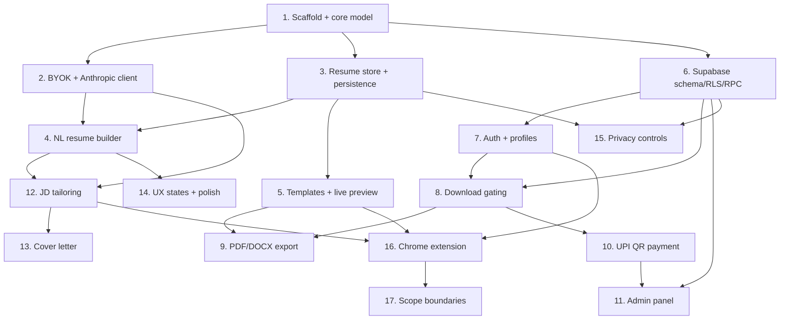

# Implementation Plan

## Overview

This plan implements ResumeForge incrementally, following the local-first, backend-light architecture. It starts with the shared data model and BYOK AI client, builds the free/interactive core (builder, templates, tailoring, cover letters, export), then layers on the tamper-proof Supabase account/gating/payment/admin systems, and finishes with the Chrome extension which depends on a stable data model. Property-based tests accompany the highest-value invariants (gating, tailoring, payment status, no-auto-submit).

## Tasks

- [x] 1. Scaffold monorepo and shared core data model
  - Set up the monorepo (`packages/core`, `apps/web`, `apps/extension`, `supabase/`) with Vite + React 18 + TypeScript + Tailwind in `apps/web`
  - Define the `ResumeData`, `ResumeVersion`, `TailoringMeta`, and `BulletChange` TypeScript types in `packages/core/model` with stable IDs on bullets/sections
  - Add `zod` validators for every model shape and export them from `packages/core`
  - Configure Supabase client to read `VITE_SUPABASE_URL` / `VITE_SUPABASE_ANON_KEY` from env (no hard-coded values)
  - _Requirements: 2.2, 7.7, 12.1_

- [x] 2. Build BYOK API key management and Anthropic client
- [x] 2.1 Implement the Anthropic client wrapper in `packages/core/ai`
  - Create a `fetch`-based client that calls `api.anthropic.com` with the user's key and maps responses to a typed `AiResult` (`no_key | auth | rate_limit | parse | network`)
  - _Requirements: 1.2, 1.6_
- [x] 2.2 Build the API key prompt and settings UI
  - First-load prompt when no key is stored; password-masked input with show/hide toggle; help link for obtaining a key
  - Store key in `localStorage` only; block AI actions with a key prompt when no key exists; allow update/clear in settings
  - _Requirements: 1.1, 1.3, 1.4, 1.5, 1.7, 12.5_

- [x] 3. Implement resume state store and persistence
  - Create Zustand store for resume-in-progress, version list, and template/style selection
  - Add debounced autosave to `localStorage`; wire persistence so base resume is preserved on reload
  - _Requirements: 2.6, 4.5_

- [x] 4. Build the natural-language resume builder
- [x] 4.1 Implement the extraction prompt builder and pipeline
  - `buildExtractionPrompt(freeformText)` targeting the `ResumeData` schema; parse + zod-validate the response; recoverable error on malformed JSON that preserves existing data
  - _Requirements: 2.2, 2.7_
- [x] 4.2 Build the chat-like intake UI and editable form
  - Chat-like intake screen; populate an editable form where every field is editable after extraction
  - _Requirements: 2.1, 2.3, 2.8_
- [x] 4.3 Add drag-and-drop bullet/section editing
  - Add/remove/reorder bullets via `@dnd-kit` with visual feedback
  - _Requirements: 2.4, 13.4_
- [x] 4.4 Add existing-resume import (text + PDF)
  - Paste-text path and client-side PDF text extraction via `pdfjs-dist`, both feeding the same extraction pipeline; fall back to manual paste on extraction failure
  - _Requirements: 2.5_

- [x] 5. Build template rendering engine and live preview
- [x] 5.1 Define the TemplateRenderer interface and first two templates
  - `TemplateRenderer` abstraction rendering the same `ResumeData`; implement Classic and Modern with real-time live preview
  - _Requirements: 3.1, 3.4, 3.5, 13.5_
- [x] 5.2 Add remaining templates and styling controls
  - Implement Compact, Two-column (with ATS warning badge), and Minimal; add font picker and safe-palette accent color picker; ensure ATS-friendly layouts
  - _Requirements: 3.1, 3.2, 3.3, 3.6_

- [x] 6. Set up Supabase schema, RLS, and RPCs
- [x] 6.1 Write schema migrations
  - Migrations for `profiles`, `products`, `user_credits`, `payment_requests`, `payment_settings`, `admins`, and optional `resumes`
  - _Requirements: 7.4, 8.7, 8.8, 9.2, 10.2, 12.2_
- [x] 6.2 Write RLS policies
  - Policies per the design's policy matrix (own-row reads, admin writes, user insert-only on `payment_requests`, public-read/admin-write on `products` & `payment_settings`)
  - _Requirements: 7.6, 8.10, 9.6, 10.10, 12.2_
- [x] 6.3 Write security-definer RPCs
  - `consume_download`, `approve_payment`, `reject_payment`, `set_free_forever` as atomic, RLS-safe functions
  - _Requirements: 8.10, 10.6, 10.7, 9.6_

- [x] 7. Implement authentication and profiles
  - Supabase Auth email/password + optional Google; allow build/edit pre-login; prompt login on download attempt
  - Create `profiles` row on signup; update `last_login_at` on login; read own profile via RLS
  - _Requirements: 7.1, 7.2, 7.3, 7.4, 7.5, 7.6_

- [x] 8. Implement download gating logic
- [x] 8.1 Write the pure gating decision function
  - `decideDownload(profile, credits, productId)` implementing the free-forever → free-<2 → credit → require-payment order with shared free counter
  - _Requirements: 8.1, 8.2, 8.3, 8.4, 8.5, 8.6_
- [x] 8.2 Write property-based tests for gating
  - PBT for Property 1 (free trial cap), Property 2 (free-forever supremacy), Property 3 (credit conservation)
  - _Requirements: 8.2, 8.3, 8.4, 8.5, 8.8_
- [x] 8.3 Wire gating to Supabase RPC and download UI
  - Call `consume_download` atomically on download; display free-count capped at 2
  - _Requirements: 8.9, 8.10_

- [x] 9. Implement PDF and DOCX export
  - PDF via `react-pdf` with selectable text matching the on-screen template; DOCX via `docx` with real heading styles; available for every saved version; runs through the gate first
  - _Requirements: 6.1, 6.2, 6.3, 6.4_

- [x] 10. Implement UPI QR payment flow
  - Generate `upi://pay?...` deep link + QR via `qrcode` from product price and `payment_settings`; "I've paid" inserts a `payment_requests` row; show pending state and keep locked; communicate manual verification
  - _Requirements: 9.1, 9.2, 9.3, 9.4, 9.5, 9.7_

- [x] 11. Build the admin panel
- [x] 11.1 Add protected /admin route and admins gating
  - Separate `/admin` route not linked in normal UI; gate via `admins` table + RLS
  - _Requirements: 10.1, 10.2_
- [x] 11.2 Build the Users tab
  - List users (email, last login, free downloads used, credits per product) with search/filter; `is_free_forever` toggle via `set_free_forever`
  - _Requirements: 10.3, 10.4_
- [x] 11.3 Build the Payment Requests tab
  - Pending list; Approve (status + credit `unlocks_count` + timestamp) and Reject via RPCs; history view
  - _Requirements: 10.5, 10.6, 10.7, 10.8_
- [x] 11.4 Build the Products & Pricing tab
  - Add/edit/deactivate products; edit global `upi_id` and note
  - _Requirements: 10.9_
- [x] 11.5 Add property-based test for payment status monotonicity
  - PBT for Property 6 (pending → approved/rejected only; credits granted exactly once per approval)
  - _Requirements: 10.6, 10.7_

- [x] 12. Implement JD-based tailoring
- [x] 12.1 Build the tailoring prompt and no-fabrication enforcement
  - `buildTailoringPrompt(resume, jd)` returning tailored data + `matchScore` + `gaps`; post-validation set-comparison that strips/flags fabricated employers/dates/degrees/skills
  - _Requirements: 4.1, 4.2, 4.3, 4.4_
- [x] 12.2 Write property-based tests for tailoring invariants
  - PBT for Property 4 (no fabrication subset) and Property 5 (base immutability)
  - _Requirements: 4.3, 4.5_
- [x] 12.3 Build version history and diff view UI
  - Save tailored result as a new version alongside base; diff view of original vs tailored bullets; accept/tweak/revert per change; matchScore + gaps checklist display
  - _Requirements: 4.4, 4.5, 4.6, 4.7_

- [x] 13. Implement the cover letter generator
  - `buildCoverLetterPrompt(resume, jd, tone)` producing a 3-4 paragraph letter; tone selector (Formal/Conversational/Enthusiastic-student); editable; export in same template family
  - _Requirements: 5.1, 5.2, 5.3, 5.4_

- [x] 14. Implement shared UX states and polish
  - Loading/progress states for AI extraction, tailoring, and export; helpful empty states; non-technical recoverable error handling via shared toast/error boundary; responsive desktop layout
  - _Requirements: 13.1, 13.2, 13.3, 13.5, 13.6_

- [x] 15. Implement data privacy controls
  - "Export my data" and "Delete all my data" for local resume content; ensure API key never sent to Supabase; only account metadata sent to Supabase; optional `resumes` sync behind RLS
  - _Requirements: 12.1, 12.2, 12.3, 12.4, 12.5, 12.6_

- [x] 16. Build the Chrome extension
- [x] 16.1 Scaffold Manifest V3 extension sharing core
  - Content script + popup + service worker; share resume/auth data via `chrome.storage.local`; reuse `packages/core`
  - _Requirements: 11.1, 11.2_
- [x] 16.2 Implement site adapters and JD extraction
  - `SiteAdapter` interface with LinkedIn Easy Apply, Indeed, and Naukri adapters; detect posting and extract JD; test against saved DOM fixtures
  - _Requirements: 11.3_
- [x] 16.3 Implement tailoring and autofill in the popup
  - "Tailor resume for this job?" reusing the tailoring flow; "Autofill this application" mapping fields via label-matching heuristics; report unmatched fields; best-effort disclaimer
  - _Requirements: 11.4, 11.5, 11.7_
- [x] 16.4 Enforce and test no-auto-submit
  - Ensure Submit/Apply is never clicked programmatically; PBT/assertion for Property 7 (zero submit clicks) against fixtures
  - _Requirements: 11.6_

- [x] 17. Enforce scope boundaries
  - Verify no auto-submit, no payment gateway, and no bulk scraping paths exist anywhere in the codebase
  - _Requirements: 14.1, 14.2, 14.3, 14.4_

## Task Dependency Graph



```json
{
  "waves": [
    { "wave": 1, "tasks": ["1"] },
    { "wave": 2, "tasks": ["2", "3", "6"] },
    { "wave": 3, "tasks": ["4", "5", "7"] },
    { "wave": 4, "tasks": ["8", "12", "14", "15"] },
    { "wave": 5, "tasks": ["9", "10", "13"] },
    { "wave": 6, "tasks": ["11", "16"] },
    { "wave": 7, "tasks": ["17"] }
  ]
}
```

## Notes

- Property-based tests are embedded in the tasks that own the corresponding logic (8.2 gating, 11.5 payment status, 12.2 tailoring, 16.4 no-auto-submit).
- Supabase URL/anon key must come from environment variables; the operator supplies their own Supabase account, so tasks avoid hard-coded credentials.
- The Chrome extension (Task 16) is intentionally last because it depends on a stable shared data model and tailoring logic.
- Optional cross-device resume sync (`resumes` table) is included in Task 15 as a nice-to-have and can be deferred without blocking v1.
